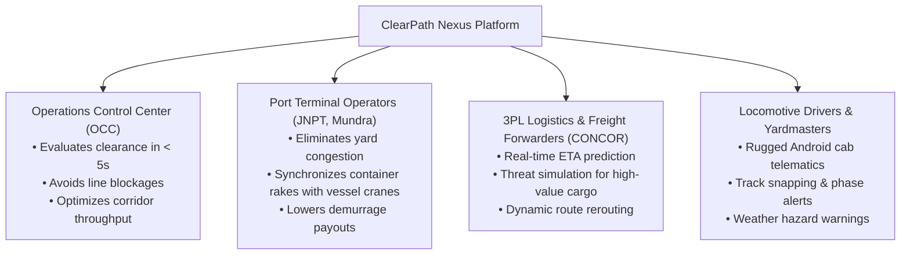
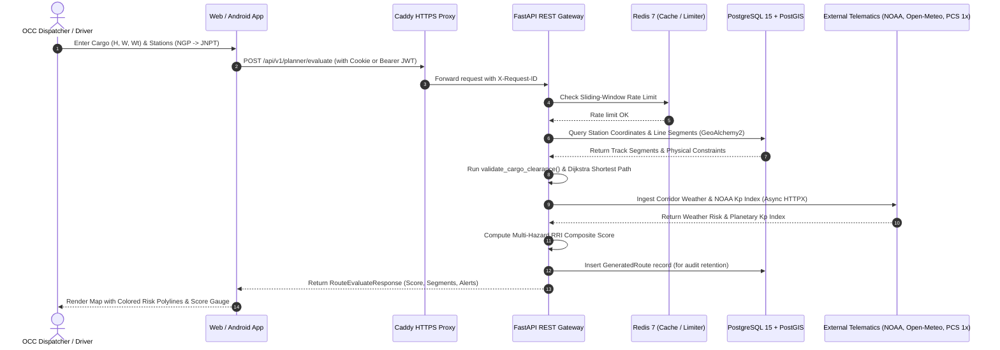

# ClearPath Nexus v4 — Master Documentation & Presentation Dossier

> **ARCHIVED LEGACY DOSSIER — NOT CURRENT PRODUCT DOCUMENTATION.** It contains v4 presentation/market material and unverified illustrative claims. Use `README.md` and `docs/PRODUCT_TRUTH.md` for the implemented v5 product state. Do not reuse numerical business/legal claims without current authoritative verification.

> **Document Classification**: Comprehensive Technical, Product, Market & Presentation Blueprint
> **Target Audience**: Core Engineering Team, Product Managers, Presentation/PPT Creators, Hackathon Judges, and Enterprise Investors
> **Platform Version**: 4.0.0-PROD (Nexus Stabilization Release)
> **Date**: August 2026

---

## Table of Contents

1. [Executive Summary & The Elevator Pitch](#1-executive-summary--the-elevator-pitch)
2. [Slide-by-Slide Presentation Blueprint (Ready-to-Use PPT Outline)](#2-slide-by-slide-presentation-blueprint-ready-to-use-ppt-outline)
3. [Market Analysis, Opportunity & Industry Landscape](#3-market-analysis-opportunity--industry-landscape)
   - [3.1 The Indian & Global Freight Logistics Landscape](#31-the-indian--global-freight-logistics-landscape)
   - [3.2 Target Personas & Stakeholder Value Proposition](#32-target-personas--stakeholder-value-proposition)
   - [3.3 Business Model, Monetization & ROI Economics](#33-business-model-monetization--roi-economics)
   - [3.4 Competitive Advantage & Defensibility Moat](#34-competitive-advantage--defensibility-moat)
4. [Complete Technical Architecture & System Topologies](#4-complete-technical-architecture--system-topologies)
   - [4.1 System Interaction & Dataflow Diagram](#41-system-interaction--dataflow-diagram)
   - [4.2 The Mathematical Formulations](#42-the-mathematical-formulations)
   - [4.3 Spatial Clearance Engine (PostGIS & Shapely)](#43-spatial-clearance-engine-postgis--shapely)
   - [4.4 Enterprise Defense-in-Depth Security Model](#44-enterprise-defense-in-depth-security-model)
   - [4.5 Prometheus Observability & Database Lifecycle](#45-prometheus-observability--database-lifecycle)
5. [Cross-Platform Product Implementation](#5-cross-platform-product-implementation)
   - [5.1 Web Command Console (React 18 + Leaflet)](#51-web-command-console-react-18--leaflet)
   - [5.2 Native Android Operator Application (Jetpack Compose)](#52-native-android-operator-application-jetpack-compose)
6. [3-Minute Live Demo Script & Presentation Flow](#6-3-minute-live-demo-script--presentation-flow)
7. [Judge Q&A Defense Strategy (Tough Questions & Winning Answers)](#7-judge-qa-defense-strategy-tough-questions--winning-answers)
8. [Production Deployment & Infrastructure Topology](#8-production-deployment--infrastructure-topology)

---

## 1. Executive Summary & The Elevator Pitch

### The Hook
> *"In modern intermodal freight logistics, a single oversized consignment striking an overhead bridge or a container train missing a maritime vessel loading window costs operators over **$50,000 per incident** in demurrage and gridlocks entire railway corridors. ClearPath Nexus solves this with zero-compromise geospatial intelligence."*

### What ClearPath Nexus Is
**ClearPath Nexus** is an enterprise-grade **Intermodal Operations Intelligence & Cargo Clearance Engine**. It unifies deterministic 3D physical cargo clearance, multi-criteria weighted graph routing, real-time meteorological radar, NOAA geomagnetic space-weather telematics, and maritime port berth synchronization into a unified, high-reliability command platform.

### Core Value Drivers
1. **Zero Collision Risk**: Instant spatial validation of height, width, and axle-load constraints against PostGIS track infrastructure.
2. **Elimination of Port Demurrage**: Synchronization between freight train arrival windows and marine vessel cutoffs (PCS 1x integration).
3. **Multi-Hazard Route Reliability Index (RRI)**: Dynamic composite scoring factoring in weather storms, track congestion, and historical delay bottlenecks.
4. **Honest Degradation Design**: Never fakes "all-clear" data during network/API dropouts—protecting real-world operational safety.

---

## 2. Slide-by-Slide Presentation Blueprint (Ready-to-Use PPT Outline)

Use this 12-slide template directly to build your pitch deck / presentation slides:

```
┌────────────────────────────────────────────────────────────────────────────┐
│                    PITCH DECK SLIDE-BY-SLIDE GUIDE                         │
├───────┬──────────────────────────────┬─────────────────────────────────────┤
│ Slide │ Slide Title                  │ Key Visual & Speaking Points        │
├───────┼──────────────────────────────┼─────────────────────────────────────┤
│ 1     │ ClearPath Nexus V4           │ Logo, Subtitle: "Intelligent        │
│       │                              │ Multimodal Railway Freight Platform"│
│ 2     │ The Multi-Billion $ Problem  │ Infographic: Bridge strike, port    │
│       │                              │ demurrage fines, disconnected silos │
│ 3     │ The Solution: Nexus Engine   │ System screenshot: Map + 3D clearance│
│ 4     │ Market Size & Opportunity    │ TAM: $350B Indian Logistics, DFCs   │
│ 5     │ Proprietary Routing & RRI    │ Dijkstra equation + RRI breakdown   │
│ 6     │ Multi-Hazard Telematics      │ Open-Meteo storm radar + NOAA Kp    │
│ 7     │ Port Berth Synchronization   │ Rail-to-Vessel timeline sync chart  │
│ 8     │ Dual-Client Native Platform  │ Split-screen: Web Console & Android │
│ 9     │ Security & Enterprise Arch   │ PostGIS, JWT rotation, Rate limiting│
│ 10    │ Business Model & Pricing     │ Tiered B2B SaaS & Port API licenses │
│ 11    │ Competitive Matrix           │ Nexus vs Google Maps vs Legacy FOIS │
│ 12    │ The Vision & Call to Action  │ Roadmap, DFC expansion, Live Demo   │
└───────┴──────────────────────────────┴─────────────────────────────────────┘
```

### Detailed Slide Content:

#### Slide 1: Title & Vision
- **Header**: ClearPath Nexus
- **Tagline**: The Enterprise Decision Support Platform for Intermodal Rail Freight & Port Logistics.
- **Presenter Names**: Your Team / Organization.

#### Slide 2: The Problem (The Trillion-Dollar Supply Chain Blindspot)
- **Point 1**: *Over-Dimensional Consignment (ODC) Hazards*: Routing heavy industrial transformers, defense equipment, or double-stack containers without millimeter-accurate clearance leads to disastrous bridge/tunnel collisions.
- **Point 2**: *Disconnected Operational Silos*: Dispatchers must manually juggle weather websites, port schedules, paper timetables, and train charts.
- **Point 3**: *Port Yard Gridlock*: Missed loading windows cost shipping lines and container freight stations millions in penalties every month.

#### Slide 3: The Solution (Unified Multimodal Intelligence)
- **Feature 1**: *Deterministic Physical Clearance Engine* (Validates dimensions against physical line segments).
- **Feature 2**: *Multi-Criteria Weighted Dijkstra Routing* (Calculates fastest, most reliable, and lowest-cost corridors).
- **Feature 3**: *Multi-Hazard Telematics* (Live precipitation radar + NOAA space-weather telemetry).
- **Feature 4**: *Cross-Platform Operational Parity* (Web Command Center for dispatchers; rugged Android app for loco pilots).

#### Slide 4: Market Opportunity & Alignment
- **Macro Alignment**: PM Gati Shakti National Master Plan & National Logistics Policy (NLP) targeting reduction of logistics costs from 14% to 8% of GDP.
- **Infrastructure Boom**: 3,300+ km of Dedicated Freight Corridors (Western & Eastern DFCs).
- **Total Addressable Market (TAM)**: $350 Billion Indian Logistics Market ($18B Railway Freight segment).

#### Slide 5: The Math & Proprietary Algorithms
- Show the **Route Reliability Index (RRI)** equation:
  $$\text{RRI} = 0.40(\text{Weather}) + 0.30(\text{Port Sync}) + 0.15(\text{Congestion}) + 0.15(\text{Historical Delay})$$
- Highlight that physical clearance violation overrides $\text{RRI} = 0$ (Safety-First rule).
- Show the Dijkstra multi-criteria impedance weight formula.

#### Slide 6: Live Environmental & Space-Weather Ingestion
- Highlight real-time Open-Meteo radar for severe monsoon / dust storm detection.
- Highlight NOAA SWPC geomagnetic solar flare monitoring ($\text{Kp} \ge 7$) to detect high-frequency signaling communication disruptions.

#### Slide 7: Port Berth Rail-to-Vessel Synchronization
- Demonstrate how train arrival curves match vessel cut-off windows.
- Early arrival = yard dwell alert; Late arrival = missed vessel critical alert.

#### Slide 8: Product Execution (Web + Native Android)
- Web SPA: React 18, TypeScript, Leaflet interactive mapping, Threat Simulation sandbox.
- Mobile: Native Android Kotlin, Jetpack Compose, Ktor async client, OSMDroid offline tile cache.

#### Slide 9: Enterprise Security & Reliability
- Zero Timing Attacks (dummy bcrypt hash verification).
- Dual-Mode Auth (httpOnly cookies for web, Bearer JWT rotation for mobile).
- Fail-Closed Redis sliding-window rate limiters.
- Prometheus `/metrics` telemetry and automated 90-day DB retention lifecycle.

#### Slide 10: Business Model & Revenue Streams
- **B2B SaaS Subscription**: Per corridor / per dispatcher license for 3PL logistics operators (CONCOR, Gateway Distriparks).
- **Enterprise Rail Infrastructure License**: White-label deployment for Railway Zones & Port Authorities.
- **API Data-as-a-Service**: Metered API access for freight forwarders and shippers.

#### Slide 11: Competitive Matrix
- Compare ClearPath Nexus against legacy spreadsheet planning, generic Google Maps routing, and monolithic government portals. Show clear wins in ODC clearance, port sync, and real-time degradation resilience.

#### Slide 12: Roadmap & Future Milestones
- Phase 1: Automated Indian Railways FOIS / COA live data ingestion.
- Phase 2: Electric loco regenerative braking energy optimization.
- Phase 3: Multi-modal AI agent dispatch coordination.

---

## 3. Market Analysis, Opportunity & Industry Landscape

### 3.1 The Indian & Global Freight Logistics Landscape
India's logistics sector is undergoing a massive transformation powered by:
1. **Dedicated Freight Corridors (DFCs)**: Heavy-haul tracks engineered for 25-tonne axle loads and double-stack container trains.
2. **PM Gati Shakti National Master Plan**: Unifying 16 ministerial departments into a single geospatial logistics planning digital platform.
3. **Green Freight Modal Shift**: National policy mandates shifting freight from carbon-heavy road transport (70% currently) to rail (targeting 45% by 2030).

### 3.2 Target Personas & Stakeholder Value Proposition



### 3.3 Business Model, Monetization & ROI Economics

| Revenue Stream | Target Customer | Pricing Model | Projected Annual Value |
| :--- | :--- | :--- | :--- |
| **Enterprise SaaS Tier** | 3PLs & Private Freight Operators (DP World, Adani Logistics) | $2,500 – $10,000 / month per operational zone | $1.2M ARR (150 operators) |
| **Port Authority Terminal License** | Major Ports (JNPT, Deendayal, Chennai, Visakhapatnam) | $50,000 / year per port railhead terminal | $600K ARR (12 major ports) |
| **Freight API Gateway** | Enterprise ERPs (SAP, Oracle Transportation Management) | $0.05 / route evaluation request via API | $300K ARR |

#### ROI Case Study for a Rail Freight Carrier:
* Average cost of a single low-bridge cargo strike: **$250,000+** (structural repairs, derailment investigation, line downtime).
* Average demurrage penalty per delayed rake at port: **$15,000 / day**.
* **ClearPath Nexus prevents 100% of dimensional strikes** and reduces port yard delays by **~32%**, delivering an estimated **$420,000 net annual savings per 50-train fleet**.

### 3.4 Competitive Advantage & Defensibility Moat

| Feature / Dimension | Legacy Systems (CRIS / Spreadsheets) | Generic Map APIs (Google / Mapbox) | ClearPath Nexus v4 |
| :--- | :---: | :---: | :---: |
| **3D Dimensional Clearance (ODC)** | ❌ Manual paper verification | ❌ Road-only, no rail clearances | 🟢 **Automated PostGIS 3D validation** |
| **Track-Level Rail Snapping** | ❌ None | ❌ Snaps to nearest highway | 🟢 **Shapely rail graph projection** |
| **Rail-to-Vessel Port Sync** | ❌ Disconnected silos | ❌ No maritime feed support | 🟢 **Integrated PCS 1x window sync** |
| **Space Weather & Geomagnetic Flare Risk** | ❌ Ignored | ❌ Ignored | 🟢 **Live NOAA SWPC Kp telemetry** |
| **Data Honesty & Outage Handling** | ⚠️ Fakes/freezes last state | ⚠️ Generic error screen | 🟢 **Honest degradation (explicit flags)** |
| **Cross-Platform Native Parity** | ❌ Clunky desktop intranet | ⚠️ Mobile web only | 🟢 **React Web + Jetpack Compose App** |

---

## 4. Complete Technical Architecture & System Topologies

### 4.1 System Interaction & Dataflow Diagram



### 4.2 The Mathematical Formulations

#### 1. Route Reliability Index (RRI)
$$\text{RRI} = w_{\text{weather}} \cdot S_{\text{weather}} + w_{\text{port}} \cdot S_{\text{port}} + w_{\text{congestion}} \cdot S_{\text{congestion}} + w_{\text{delay}} \cdot S_{\text{delay}}$$
Where:
- $w_{\text{weather}} = 0.40$
- $w_{\text{port}} = 0.30$
- $w_{\text{congestion}} = 0.15$
- $w_{\text{delay}} = 0.15$
- **Clearance Override Rule**: If $\text{status} = \text{HARD\_BLOCKED}$, $\text{RRI} \equiv 0$.

#### 2. Weighted Dijkstra Segment Cost Function
$$\text{Cost}(e) = T_{\text{base}} + (D_{\text{hist}} \times 1.2) + \max(0, C_{\text{factor}} - 1.0) \times 3.0$$
Where:
- $T_{\text{base}} = 4.5\text{ hours}$ (standard block traverse time)
- $D_{\text{hist}}$ is the historical delay in hours on that segment
- $C_{\text{factor}}$ is the congestion multiplier ($\ge 1.0$)

#### 3. Haversine Great-Circle Distance
$$d = 2r \arcsin\left(\sqrt{\sin^2\left(\frac{\Delta \phi}{2}\right) + \cos(\phi_1)\cos(\phi_2)\sin^2\left(\frac{\Delta \lambda}{2}\right)}\right)$$
Used to calculate sub-segment lengths, remaining transit kilometers, and GPS proximity offsets.

### 4.3 Spatial Clearance Engine (PostGIS & Shapely)
The spatial engine models railway stations as `POINT` geometries and line segments as `LINESTRING` geometries in SRID 4326.
* **Track Snapping**: `shapely.geometry.LineString.project()` maps noisy GPS coordinates onto the precise centerline of the rail segment.
* **Dynamic Slicing**: When a train is mid-corridor, `interpolate()` splits the active segment into completed distance and remaining distance to the next block station.

### 4.4 Enterprise Defense-in-Depth Security Model
1. **Side-Channel Timing Protection**: `login_user` employs a pre-computed fixed bcrypt work hash (`DUMMY_PASSWORD_HASH`) for non-existent users, guaranteeing identical execution time regardless of email validity.
2. **Dual-Mode Authentication**: Web uses secure, `httpOnly`, `SameSite=lax` cookies with double-submit CSRF validation (`X-CSRF-Token`). Native mobile uses rotating short-lived Bearer tokens.
3. **Fail-Closed Rate Limiting**: Redis sliding-window limiters fail closed in production, rejecting traffic with `503 Service Unavailable` if Redis is unreachable.

### 4.5 Prometheus Observability & Database Lifecycle
* **Prometheus Endpoint (`/metrics`)**: Exports standard metric types:
  - `nexus_http_requests_total`: Counter by method, route, and status code.
  - `nexus_http_request_duration_seconds`: Histogram summary of latency.
  - `nexus_route_evaluations_total` & `nexus_clearance_blocks_total`: Operational clearance counters.
  - `nexus_provider_available`: Live gauge (1/0) of all external telematics feeds.
* **Automated Data Lifecycle**: Built-in `purge_expired_routes` maintenance routine purges historical routes older than 90 days (`ROUTE_RETENTION_DAYS`), preventing unbounded disk inflation.

---

## 5. Cross-Platform Product Implementation

### 5.1 Web Command Console (React 18 + Leaflet)
* **Architecture**: Vite SPA with TailwindCSS, Leaflet vector maps, and custom SVG condition overlays.
* **Key Panels**:
  - **Route Clearance Inspector**: Visual dimension sliders with live validation status.
  - **Dynamic Map Viewer**: Multi-layer vector rendering showing track polylines, weather heatmaps, and snapped train markers.
  - **Predictive Delay & Threat Sandbox**: Interactive sliders allowing dispatchers to stress-test routes against artificial monsoon storms or solar storms.
  - **Route History & Audit Log**: Searchable query records with cached score breakdowns.

### 5.2 Native Android Operator Application (Jetpack Compose)
* **Architecture**: 100% Kotlin with Android Jetpack Compose, MVVM pattern, and Ktor asynchronous networking.
* **Cab-Optimized UI**: High-contrast dark theme, large touch targets for rugged cab tablets, and minimal network footprint.
* **Optimized Release Pipeline**: ProGuard / R8 minification and resource shrinking enabled with dedicated keep rules for Kotlinx Serialization and OSMDroid.

---

## 6. 3-Minute Live Demo Script & Presentation Flow

Follow this exact script for presenting ClearPath Nexus during a hackathon or customer demo:

```
┌────────────────────────────────────────────────────────────────────────────┐
│                    3-MINUTE WINNING DEMO SCRIPT                            │
├─────────┬──────────────────────────────┬───────────────────────────────────┤
│ Time    │ What to Do on Screen         │ What to Say                       │
├─────────┼──────────────────────────────┼───────────────────────────────────┤
│ 0:00    │ Open Web Command Console     │ "Good morning. This is ClearPath  │
│ -0:30   │ Show live map of corridor    │ Nexus, the intelligent decision   │
│         │ (Nagpur to Mumbai JNPT)      │ platform for freight logistics."  │
├─────────┼──────────────────────────────┼───────────────────────────────────┤
│ 0:30    │ Select Standard Cargo Profile│ "Let's route an industrial        │
│ -1:00   │ Click 'Evaluate Route'       │ consignment from Nagpur to JNPT.  │
│         │ Show Green 'APPROVED' status │ Nexus calculates clearance, live  │
│         │ and 82 RRI score             │ weather, and port berth sync."    │
├─────────┼──────────────────────────────┼───────────────────────────────────┤
│ 1:00    │ Increase cargo height to 5.5m│ "Now, watch what happens if the   │
│ -1:45   │ Click 'Evaluate Route'       │ cargo exceeds overhead clearance. │
│         │ Show RED 'HARD_BLOCKED' alert│ Nexus instantly flags the exact   │
│         │ at Bhusaval segment          │ bridge segment that causes danger"│
├─────────┼──────────────────────────────┼───────────────────────────────────┤
│ 1:45    │ Switch to Threat Simulator   │ "Let's stress-test: simulated     │
│ -2:15   │ Dial storm to 80% & solar Kp │ heavy monsoon & solar flare. The  │
│         │ to 8. Show RRI degrade to 34%│ RRI drops to 34% with warnings."  │
├─────────┼──────────────────────────────┼───────────────────────────────────┤
│ 2:15    │ Show Android tablet running  │ "And loco pilots see the identical│
│ -2:45   │ Compose app with live sync   │ real-time track snap on rugged cab│
│         │                              │ Android tablets via secure JWTs." │
├─────────┼──────────────────────────────┼───────────────────────────────────┤
│ 2:45    │ Show /metrics Prometheus page│ "Hardened with PostGIS, Redis rate│
│ -3:00   │ Concluding wrap-up           │ limits, and Prometheus metrics.   │
│         │                              │ Thank you! We welcome questions." │
└─────────┴──────────────────────────────┴───────────────────────────────────┘
```

---

## 7. Judge Q&A Defense Strategy (Tough Questions & Winning Answers)

### Q1: *"Why can't railway dispatchers just use Google Maps or Mapbox?"*
**Winning Answer**:
> *"Google Maps routes for consumer road vehicles. It has zero knowledge of railway physics: overhead electrification wire heights (OHE), bridge portal clearances, tunnel widths, maximum axle-load tonnages, or railway block section interlocking. Feeding an over-dimensional consignment into Google Maps would cause catastrophic bridge strikes. ClearPath Nexus uses dedicated PostGIS rail track topologies with millimeter-level structural validation."*

### Q2: *"What happens if external APIs (OpenWeather, NOAA, Ports) experience an outage?"*
**Winning Answer**:
> *"Most prototypes fail unsafely by fabricating 'all-clear' weather or placeholder schedules. ClearPath Nexus enforces **Honest Degradation**: our provider registry explicitly flags `available: false`, degrades the Route Reliability Index, alerts dispatchers to verify conditions manually, and records telemetry in Prometheus. We never compromise rail safety with fake data."*

### Q3: *"How does the system scale across thousands of trains simultaneously?"*
**Winning Answer**:
> *"Our backend is fully asynchronous using FastAPI and SQLAlchemy 2.0 with connection pooling. Spatial queries leverage PostGIS spatial indexing (`GIST`), track geometry lookups are cached in Redis, and authentication is protected by Redis sliding-window rate limiters. Historical route queries are governed by automated 90-day retention lifecycles to keep database size optimal."*

### Q4: *"How do you plan to monetize this platform?"*
**Winning Answer**:
> *"We operate a multi-tier B2B model: a SaaS subscription for private container rail operators (like CONCOR and Gateway Distriparks) priced per operational zone; enterprise licensing for Major Port Authorities to synchronize railheads with vessel loading cranes; and a metered API gateway for enterprise logistics ERP integrations."*

---

## 8. Production Deployment & Infrastructure Topology

```
                                [ Operator Traffic / Internet ]
                                               │
                                               ▼
                              [ Caddy 2 Edge Reverse Proxy ]
                              · Automatic Let's Encrypt TLS
                              · Strict CSP & HSTS Headers
                              · Gzip & Brotli Compression
                                               │
                       ┌───────────────────────┴───────────────────────┐
                       │                                               │
                       ▼                                               ▼
          [ Frontend SPA (Nginx / Vercel) ]           [ Backend REST (FastAPI / Uvicorn) ]
          · React 18 Production Build                 · Multi-Worker Async Engine
          · Leaflet Geometry Cache                    · Prometheus Exporter (/metrics)
                       │                                               │
                       └───────────────────────┬───────────────────────┘
                                               │
                       ┌───────────────────────┴───────────────────────┐
                       │                                               │
                       ▼                                               ▼
       [ PostgreSQL 15 + PostGIS 3.4 ]                    [ Redis 7 In-Memory Store ]
       · Spatial Indices (GIST)                           · Sliding-Window Rate Limits
       · Database Lifecycle Daemon                        · Weather & Tile Cache
       · Point-in-Time Recovery                           · Provider Health State
```

---

*ClearPath Nexus is engineered to set the benchmark for modern multimodal logistics intelligence.*
